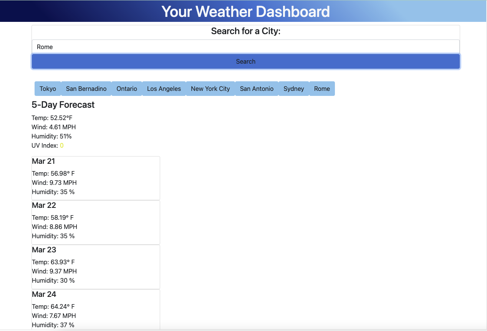

# Autumn's Weather Dashboard 🌧

## Week 6 Challenge

This week's challenge was to build a weather dashboard site from scratch that fulfilled all of the USER STORY requirements. However, I was not able to get weather icons to show up nor get the search history buttons to repull from the APIs. Although these were not met, I still strengthened my knowledge of HTML, CSS, javaScript and jQuery.

### Construction and Collaboration
This week's challenge was tough to complete, as most people in this class were doing both Challenge 6 and Project 1. A lot of were struggling to grasp javaScript concepts and were discouraged. Last minute study sessions and video calls were a must, for me especially. The great part about this course is not only learning code, but learning to develop and collaborate with team members. What turned a Saturday night breakdown into a success was the classmates that pulled together to explain concepts and go over lessons. 
- With their help I was able to accomplish the following:
    - Build a js file from the ground up using jquery and vanilla js
    - See multiple different ways of accomplishing what was in my head; 
    ex: Using hardcoded elements and assigning text content/value to them versus dynamically creating them
    - Use multiple APIs to call and input weather data for cities all over the world (except weather icons)
    - Use bootstrap to create a polished UI
    - Use moment.js to convert milliseconds into current time

As always, comments are included in the files.

### Preview of My Work ☀️
View the deployed webpage [here!](https://pixiepucker.github.io/weather-ch6/)

#### Credits
My lovely classmates 💙   

Scenario, instruction, and starter code provided by UTSA's Trilogy Coding Bootcamp.
